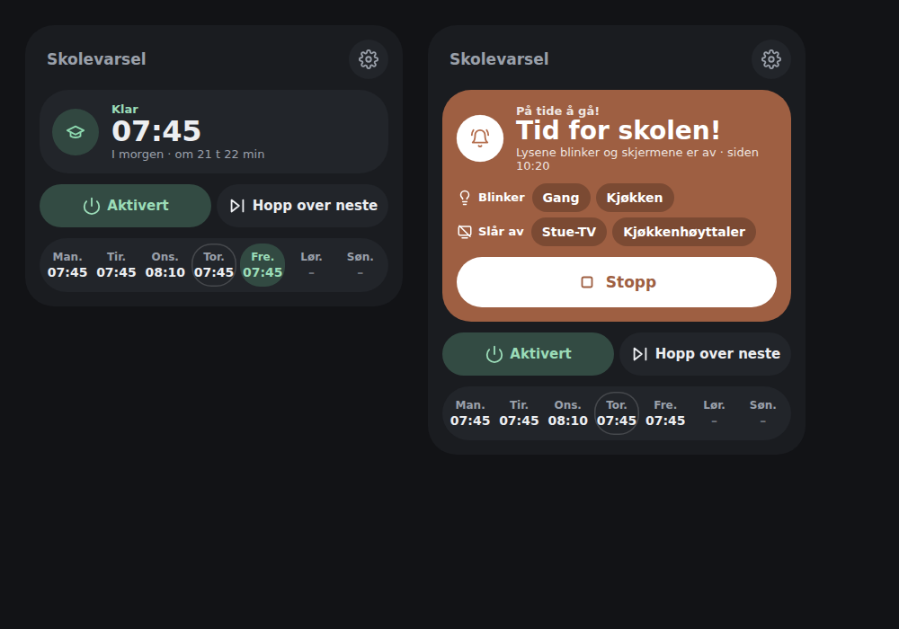
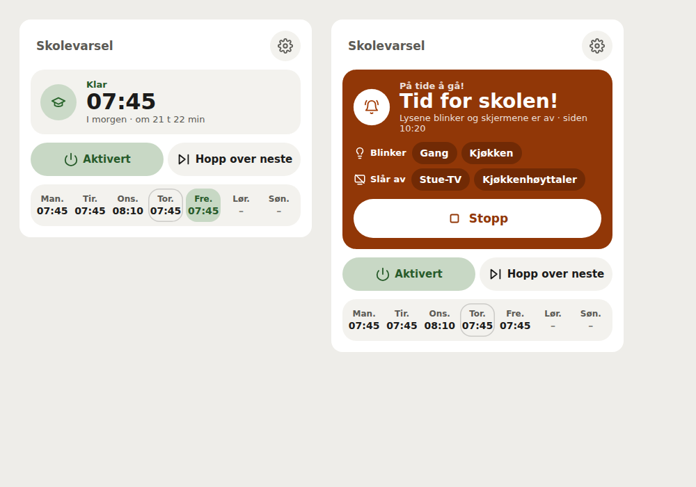
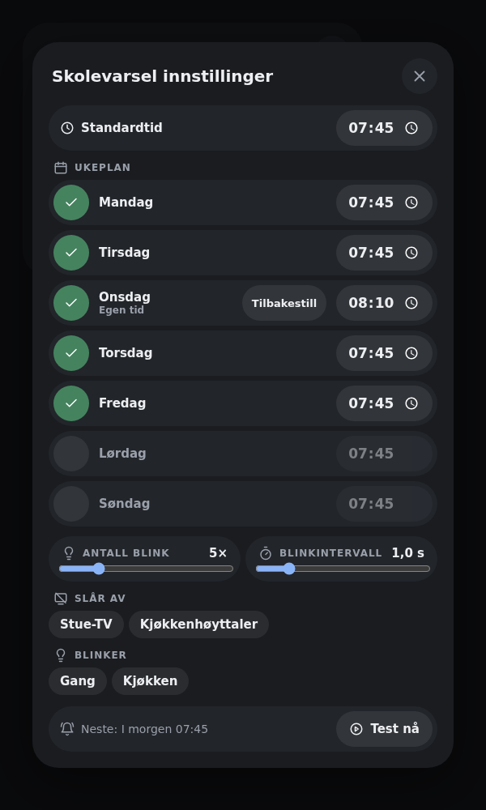
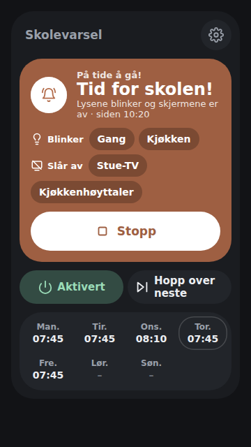

# Lovelace Time for School Card

A dashboard card for the
[Time for School](https://github.com/mvheimburg/time-for-school)
integration.



The everyday card shows only what the household needs in the morning:

- **Status hero** with the next alert time as the headline, the day and how long
  until it fires. The icon and status line are tinted by state: green when
  armed, amber when *Skip next* is on, grey when off or unavailable.
- **Time to go** takeover while the alert runs: an amber panel (a reminder, not
  an emergency) listing the lights that blink and the devices that were turned
  off, with a big white **Stop** button.
- **Enabled** and **Skip next** as two pill switches. Skip next shows which
  alert it skips.
- **This week** strip with each weekday's time; the next alert's day is
  highlighted, today is outlined and a skipped day is struck through.
- The round **Configure** cog (top right) opens the settings that are not needed
  every day, in a modal: the **default time** and the weekly schedule, blink
  count and interval, the devices that are turned off and the lights that blink,
  and **Test now**. Changes apply immediately through the integration's
  services; close with the close button, Escape or a click outside.
- **Default time** (0.5.0, with Time for School integration 0.4.0 or later), as
  on the Personal Wakeup card: every school day follows it. Turn each weekday on
  or off; change a day's time to give it its own (marked *Own time*), and
  **Reset** puts it back on the default. With an older integration each day
  keeps its own time as before.
- A time is sent when you finish editing it (leave the field or press Enter),
  or at once when a time picker sets it; typing the hour no longer sends a
  half-typed time. After a refusal the field shows the saved time again.
- Device selections persist in the integration options. Changing devices during
  an alert stops it and restores the lights before applying the new selection.
- Actions show as pending until Home Assistant answers, cannot be sent twice,
  and are disabled while the entity is unavailable. Failed service calls show a
  Home Assistant toast and the card keeps showing Home Assistant's value.

Default appearance in a light theme, and the Configure modal:






Since 0.3.0 the card follows the same visual language as the House State,
Water Guard and Access Control cards. It adds the week strip on the card;
services, settings and the card configuration are unchanged.

## Install

### HACS
Add this repository as a custom repository (category *Dashboard*) and install
**Time for School Card**. HACS registers the resource for you.

### Manual
1. Copy `dist/lovelace-time-for-school.js` to `config/www/`.
2. Add `/local/lovelace-time-for-school.js` as a *JavaScript module* resource
   under **Settings → Dashboards → Resources**.

## Card config

```yaml
type: custom:lovelace-time-for-school-card
entity: sensor.time_for_school
name: School run        # optional
```

## Appearance

Choose **Default** or **Bubble** in the dashboard card editor, or add
`appearance: bubble` to the card YAML. Omitting it keeps the default appearance.
The Bubble preset styles both the compact card and its settings modal; it does
not require Bubble Card to be installed.

The preset inherits these shared CSS variables from your Home Assistant theme:
`--bubble-main-background-color` (card and modal), `--bubble-secondary-background-color`
(hero, pills and rows), `--bubble-border-radius`, `--bubble-sub-button-border-radius`,
`--bubble-icon-border-radius`, `--bubble-border` and `--bubble-box-shadow`.
Status colours come from the Home Assistant theme (`--success-color`,
`--warning-color`, `--orange-color`, `--disabled-text-color`), so the time to go
panel stays amber whatever the Bubble accent. Since 0.3.0 the card no longer
reads `--bubble-accent-color`, `--bubble-icon-background-color` or
`--bubble-sub-button-background-color`.

For example, in an HA theme (theme keys omit the leading `--`):

```yaml
bubble-border-radius: 28px
bubble-secondary-background-color: "#22252a"
```

CSS applied locally inside another Bubble Card does not carry over. This is
a visual preset, not support for Bubble Card modules or its pop-up engine.

## Build

```bash
npm ci
npm run lint
npm run typecheck
npm run build      # writes dist/lovelace-time-for-school.js
npm test           # browser tests (Vitest + Playwright)
node scripts/screenshot.cjs   # regenerates images/ from simulated data
```

CI checks that `dist/` is committed up to date. Releases are automatic: bump
`version` in `package.json`, merge to `main`, and the release workflow tags
`v<version>` and attaches the built card to a GitHub release.

## Language

Card controls, status labels, schedules, settings, accessibility labels and the visual editor follow Home Assistant's frontend language (`hass.language`, falling back to `hass.locale.language`). Bokmål is available for `nb`/`nb-NO`, with legacy `no` and `nn` aliases; matching ignores case and accepts underscores. Other languages fall back to English. Changing the frontend language updates the card and editor immediately.

Custom titles, entity friendly names, playlist names and backend error details are shown unchanged. Service names, entity IDs, weekday keys and configuration values remain unchanged. The static card-picker registration uses the English product name and description because it has no Home Assistant language context.

## Color schemes

Choose **Color scheme** in the card's visual editor. The setting is per card and
works with both **Default** and **Bubble** appearance, including in-card dialogs.
Every card supplied by this package offers the same choices:

| Scheme | YAML value | Palette |
| --- | --- | --- |
| Home Assistant (default) | `home-assistant` | Follows your dashboard theme and Bubble color variables |
| Bright | `bright` | White surfaces with blue accents |
| Warm | `warm` | Ivory surfaces with warm brown accents |
| Mint | `mint` | Pale green surfaces with green accents |
| Sky | `sky` | Pale blue surfaces with blue accents |
| Lavender | `lavender` | Pale purple surfaces with purple accents |

For example, add these options to your existing card configuration:

```yaml
appearance: bubble
color_scheme: mint
```

The five light schemes stay light even on a dark dashboard and override inherited
colors only within this card. Status colors retain their meaning (green for
success, amber for warnings and red for errors). Remove `color_scheme` or choose
**Home Assistant** to follow the dashboard again. Existing configurations keep
their current appearance. Scheme names and the editor label support English and
Norwegian Bokmål; YAML values remain unchanged in either language. Static
card-picker metadata remains English because it has no Home Assistant language
context.
