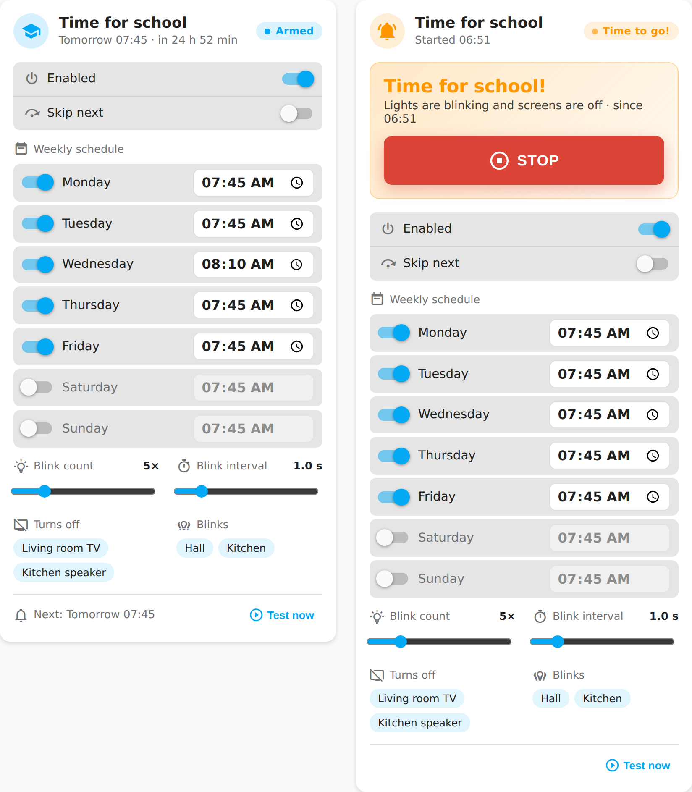
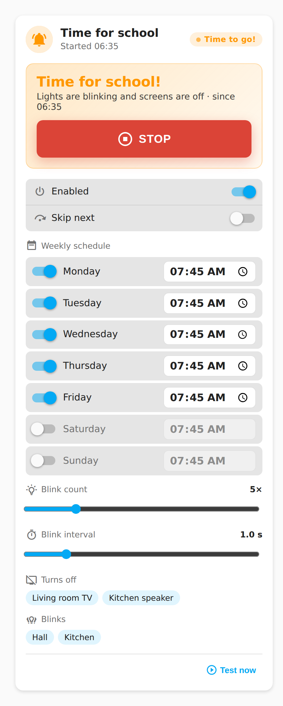

# Lovelace Time for School Card

A dashboard card for the
[Time for School](https://github.com/mvheimburg/time-for-school)
integration.



- Compact main card with status, next alert, master enabled switch and skip-next.
- Gear button opens settings with the weekly schedule, blink count and interval,
  editable device selections, and **Test now**. Changes apply immediately.
- Device selections persist in the integration options. Changing devices during
  an alert stops it and restores the lights before applying the new selection.
- Close settings with the close button, Escape, or a click outside the modal.
- Big **Stop** button on the main card while the alert is running.
- Failed service calls show a Home Assistant toast.

On a phone the card stacks into a single column:



## Install

### HACS
Add this repository as a custom repository (category *Dashboard*) and install
**Time for School Card**. HACS registers the resource for you.

### Manual
1. Copy `dist/lovelace-time-for-school.js` to `config/www/`.
2. Add `/local/lovelace-time-for-school.js` as a *JavaScript module* resource
   under **Settings → Dashboards → Resources**.

## Card config

```yaml
type: custom:lovelace-time-for-school-card
entity: sensor.time_for_school
name: School run        # optional
```

## Appearance

Choose **Default** or **Bubble** in the dashboard card editor, or add
`appearance: bubble` to the card YAML. Omitting it keeps the default appearance.
The Bubble preset styles both the compact card and its settings modal; it does
not require Bubble Card to be installed.

The preset inherits these shared CSS variables from your Home Assistant theme:
`--bubble-main-background-color`, `--bubble-secondary-background-color`,
`--bubble-accent-color`, `--bubble-border-radius`, `--bubble-icon-border-radius`,
`--bubble-icon-background-color`, `--bubble-sub-button-border-radius`,
`--bubble-sub-button-background-color`, `--bubble-border`, and
`--bubble-box-shadow`. Without overrides it uses the current HA theme colors
and rounded Bubble-style defaults. Alarm warning and stop colors stay distinct.

For example, in an HA theme (theme keys omit the leading `--`):

```yaml
bubble-border-radius: 28px
bubble-accent-color: "#009688"
```

CSS applied locally inside another Bubble Card does not carry over. This is
a visual preset, not support for Bubble Card modules or its pop-up engine.

## Build

```bash
npm ci
npm run lint
npm run typecheck
npm run build      # writes dist/lovelace-time-for-school.js
```

CI checks that `dist/` is committed up to date. Releases are automatic: bump
`version` in `package.json`, merge to `main`, and the release workflow tags
`v<version>` and attaches the built card to a GitHub release.

## Language

Card controls, status labels, schedules, settings, accessibility labels and the visual editor follow Home Assistant's frontend language (`hass.language`, falling back to `hass.locale.language`). Bokmål is available for `nb`/`nb-NO`, with legacy `no` and `nn` aliases; matching ignores case and accepts underscores. Other languages fall back to English. Changing the frontend language updates the card and editor immediately.

Custom titles, entity friendly names, playlist names and backend error details are shown unchanged. Service names, entity IDs, weekday keys and configuration values remain unchanged. The static card-picker registration uses the English product name and description because it has no Home Assistant language context.
